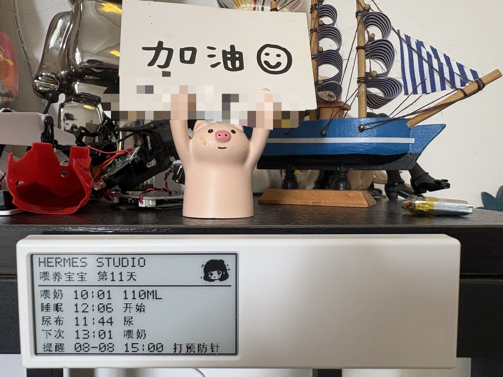
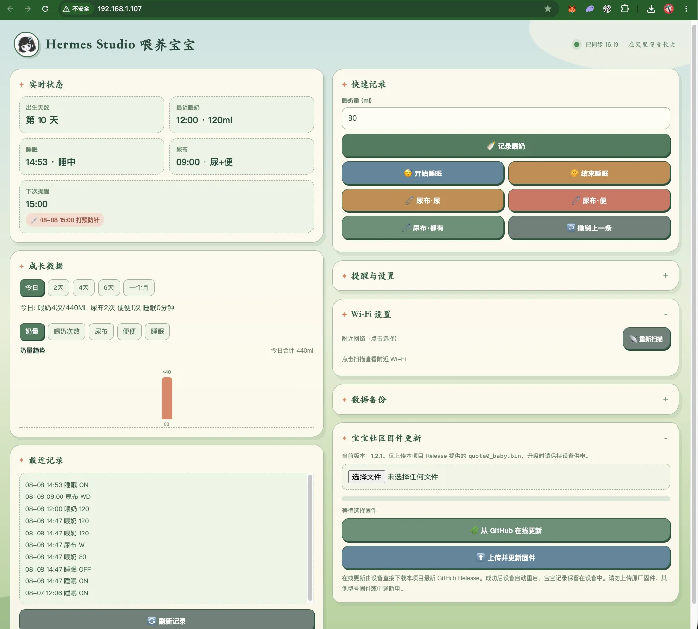

# hermes-studio 宝宝看板

[返回项目首页](../README.md) | [下载最新固件](https://github.com/thursdaycapital/hermes-studio-baby-dashboard/releases/latest)

Quote/0 宝宝看板是一套开源、本地优先的新生儿照护记录工具。它把
MindReset Quote/0 改造成一块低功耗墨水屏，可以显示宝宝天数、最近喂奶、
睡眠、尿布、下次喂奶和疫苗提醒。

手机连接同一个局域网后，可以直接打开设备网页记录数据。Hermes Studio
也可以通过 MCP Bridge 读取和更新看板。宝宝数据保存在设备 NVS 和本机
SQLite 数据库中，不需要官方云服务。

## 使用前必读：当前为公开 Beta

本项目是社区开发的独立开源固件，不是 MindReset 官方产品，也不是医疗器械。
它目前适合小范围测试和有刷机经验的用户，不建议在无人提供技术支持的情况下
批量交付给普通家庭。

### 适合现在使用的人

- 能自行使用 ESP-IDF，或身边有人可以协助首次 USB 烧录
- 愿意在升级前备份原厂固件和宝宝记录
- 设备只连接可信的家庭 2.4 GHz Wi-Fi
- 能接受遇到问题时通过 USB、恢复热点或 GitHub Issue 排查

### 当前限制与风险

- **首次安装门槛：** Release 中的 `quote0_baby.bin` 是 OTA 应用镜像，不能
  单独用于原厂设备第一次改刷；首次安装必须从源码执行完整的 `idf.py flash`。
- **原厂恢复：** 本仓库不提供原厂固件，也不保证改刷后能够恢复原厂云服务；
  动手前请自行读取并保管原厂 Flash。
- **局域网安全：** 恢复热点默认密码为 `baby1234`，API 令牌由设备 MAC 推导。
  请勿连接公共或访客网络，不要做端口转发，也不要把令牌发到聊天或 GitHub。
- **多设备冲突：** 所有设备默认广播 `quote0-baby.local`。同一局域网建议只运行
  一台；多台设备可能出现域名冲突，Hermes 自动发现也可能连接错设备。
- **数据容量：** ESP32 端只保留最近 32 条记录。长期数据需要定期导出 JSON，
  Hermes 本机 SQLite 数据库也应单独备份。
- **兼容范围：** 当前主要在一台 Quote/0 真机上验证，尚未覆盖所有生产批次、
  手机浏览器、路由器、断电组合和数周连续运行情况。
- **网络兼容：** 部分路由器会屏蔽 mDNS；此时 `quote0-baby.local` 可能打不开，
  需要继续使用路由器分配的设备 IP。
- **照护边界：** 统计和提醒只能辅助记录，不能判断奶量是否正常，也不能替代
  儿科医生。宝宝出现发热、喂养困难、精神反应异常等情况时应及时就医。

建议先在 3–5 台设备上进行至少两周测试，覆盖首次安装、重新配网、断电恢复、
备份回灌和 OTA，再逐步扩大使用范围。问题请通过 GitHub Issue 提交，并避免
附带宝宝姓名、家庭 Wi-Fi、API 令牌或完整记录文件。



## 网页看板效果

手机或电脑连接设备所在的 Wi-Fi 后，即可在浏览器中记录喂奶、睡眠和尿布，
查看近期记录与多日趋势，设置喂奶、疫苗提醒，并导出或恢复本地数据备份。



## 主要功能

- 中文墨水屏宝宝看板
- 手机局域网页面，无需安装 App
- 记录喂奶量、睡眠和尿布
- 今日、2 天、4 天、6 天和一个月趋势图
- 喂奶后自动计算下次提醒
- 自动更新宝宝出生天数
- 指定日期和时间的疫苗提醒
- Hermes Studio MCP 工具
- Wi-Fi OTA 无线升级
- USB 命令和故障恢复

## 硬件与软件要求

硬件：

- MindReset Quote/0
- ESP32-C3，4 MB Flash
- 152×296 单色墨水屏
- UC8251D 显示控制器
- 一根支持数据传输的 USB 线

电脑端：

- macOS 或 Linux
- Python 3
- Git
- ESP-IDF 6.x

## 一、下载源码

显示驱动通过 Git 子模块提供，因此克隆时需要加入
`--recurse-submodules`：

```bash
git clone --recurse-submodules https://github.com/thursdaycapital/hermes-studio-baby-dashboard.git
cd hermes-studio-baby-dashboard
```

如果已经普通克隆过仓库，请补充下载子模块：

```bash
git submodule update --init --recursive
```

## 二、编译固件

先进入已经配置好的 ESP-IDF 环境，然后执行：

```bash
idf.py build
```

成功后会生成：

```text
build/quote0_baby.bin
```

项目使用 ESP32-C3、4 MB Flash 和双 OTA 分区。不要随意更改
`partitions.csv` 中的分区偏移，否则已有 OTA 固件可能无法启动。

## 三、首次通过 USB 烧录

用数据线连接 Quote/0，查找串口：

```bash
ls /dev/cu.usbmodem*
```

然后编译并烧录：

```bash
idf.py -p /dev/cu.usbmodemXXXX flash
```

烧录完成后设备会自动重启。首次烧录会写入启动程序、分区表和应用固件，
不会主动擦除 NVS 数据分区。

> GitHub Release 中单独提供的 `quote0_baby.bin` 是 OTA 应用镜像，不适合
> 原厂设备第一次安装时单独写入。首次改刷请从源码执行完整的
> `idf.py flash`。

## 四、配置家庭 Wi-Fi

没有家庭网络配置时，设备会创建临时热点：

```text
热点名称：Quote0-Baby-XXXX
默认密码：baby1234
配置页面：http://192.168.4.1
```

操作步骤：

1. 用手机连接 `Quote0-Baby-XXXX`。
2. 浏览器打开 `http://192.168.4.1`。
3. 扫描并选择家里的 2.4GHz Wi-Fi。
4. 输入密码并保存。
5. 等待设备重启并加入局域网。

ESP32-C3 不支持 5GHz Wi-Fi。如果页面保存后设备始终无法上线，请确认
路由器已经开启 2.4GHz 网络。

### 没有按键时怎样重新配网

Quote/0 本身没有可用的交互按键，因此恢复配网由固件自动完成：

- 首次启动且没有保存 Wi-Fi 时，立即开启 `Quote0-Baby-XXXX` 热点。
- 已保存的 Wi-Fi 名称或密码错误时，固件重试连接约 11 次。
- 多次连接失败后，自动开启同名恢复热点，不需要按键或清空设备。
- `XXXX` 来自每台设备 MAC 地址末四位，因此不同设备名称不同。
- 手机连接热点后不会自动弹出门户页面，需要手动打开
  `http://192.168.4.1`。

保存新的家庭 Wi-Fi 后设备会自动重启。宝宝状态、历史和提醒保存在另一组
NVS 数据中，重新配网不会主动清除这些记录。

## 五、打开手机看板

手机与设备连接同一个局域网后，在浏览器打开设备 IP，例如：

```text
http://设备IP/
```

新版固件同时广播固定的局域网名称。在支持 mDNS 的手机和路由器上，可以
直接打开：

```text
http://quote0-baby.local/
```

如果 `.local` 地址无法解析，继续使用路由器显示的设备 IP 即可。

可以在路由器设备列表中查找 `Quote0-Baby`，也可以在电脑运行：

```bash
python3 hermes_bridge.py STATUS
```

Bridge 会先通过 UDP 广播寻找设备，找不到时再尝试 USB。

网页支持：

- 记录喂奶量
- 开始或结束睡眠
- 记录尿、便或两者都有
- 撤销上一条记录
- 设置喂奶间隔和下一次提醒
- 设置疫苗提醒
- 查看历史记录与趋势
- 每 4 秒自动发现其他照护者提交的新记录
- 导出或恢复带版本校验的 JSON 备份
- 添加到手机主屏幕，以独立窗口打开

浏览器要求 HTTPS 才能启用 Service Worker，因此通过局域网 HTTP 打开时，
“添加到主屏幕”可以使用，但离线缓存不保证生效。断网时不要继续填写记录，
应等待页面右上角恢复显示“已同步”。

### 备份与恢复

展开网页右侧的“数据备份”：

1. 点击“导出备份”，保存 JSON 文件。
2. 需要恢复时点击“恢复备份”并选择该文件。
3. 固件会先校验版本、字段、时间、记录类型和数量；全部通过后才覆盖 NVS。

备份包含当前屏幕状态、喂奶间隔和设备最近 32 条历史记录，不包含 Wi-Fi
密码和局域网 API 令牌。恢复会覆盖设备上的现有记录，操作前请先导出一次。

## 六、保存设备访问令牌

设备会根据硬件 MAC 生成局域网 API 令牌。连接 USB 后可以从启动日志中
找到 `API token`：

```bash
idf.py -p /dev/cu.usbmodemXXXX monitor
```

把令牌保存到项目目录：

```bash
printf '%s\n' 'YOUR_DEVICE_TOKEN' > .quote0-token
```

`.quote0-token` 已被 `.gitignore` 排除，不会上传 GitHub。也可以使用环境变量：

```bash
export QUOTE0_TOKEN='YOUR_DEVICE_TOKEN'
```

不要在截图、Issue、日志或公开仓库里提交真实令牌。

## 七、命令行使用

读取当前状态：

```bash
python3 hermes_bridge.py STATUS
```

记录一次 80ml 喂奶：

```bash
python3 hermes_bridge.py FEED 20:33 80
```

记录尿布：

```bash
python3 hermes_bridge.py DIAPER 21:10 W
python3 hermes_bridge.py DIAPER 21:10 D
python3 hermes_bridge.py DIAPER 21:10 WD
```

记录睡眠：

```bash
python3 hermes_bridge.py SLEEP 21:30 ON
python3 hermes_bridge.py SLEEP 23:10 OFF
```

其他常用命令：

```text
DAY 11                  设置宝宝出生天数
NEXT 23:30 FEED         设置下一次喂奶提醒
INTERVAL 180            设置喂奶间隔为 180 分钟
REMIND 08-08 15:00 SHOT 设置疫苗提醒
SUMMARY                 查看今日统计
HIST 10                 查看最近 10 条记录
UNDO                    撤销最后一条记录
SHOW                    强制刷新墨水屏
```

## 八、接入 Hermes Studio

在 Hermes Studio 中新增一个 stdio MCP Server：

```text
名称：quote0-baby
命令：python3
参数：/绝对路径/hermes-studio-baby-dashboard/hermes_bridge.py --mcp
```

令牌可以放在项目的 `.quote0-token` 文件中，或者给 MCP Server 设置
`QUOTE0_TOKEN` 环境变量。

项目提供了 `hermes-skill/SKILL.md`，可以把该目录安装为 Hermes Skill。
配置完成后新建会话，再尝试这些自然语言指令：

```text
宝宝刚喝了 90ml
宝宝开始睡觉了
刚换尿布，有尿
今天一共喝了多少
看看最近十条记录
周六上午九点提醒打预防针
```

Hermes 可以调用 11 个宝宝记录、状态、统计和提醒工具。它是记录助手，
不是医疗器械；出现喂养困难、发热或其他健康异常时，请联系儿科医生。

## 九、Wi-Fi OTA 无线升级

打开设备网页 `http://quote0-baby.local/`，展开“宝宝社区固件更新”，选择从本项目
Release 下载的 `quote0_baby.bin`，再点击“上传并更新固件”。网页会显示上传进度，
成功后设备自动重启。手机与设备需连接同一个局域网，整个过程不需要数据线。

更简单的方法是点击“从 GitHub 在线更新”。手机浏览器会通过 HTTPS 直接读取本仓库
`main/docs/firmware/quote0_baby.bin`，随后自动上传到设备；设备验证固件后写入备用 OTA
分区并重启。这样可以避开 Release 附件的跨域限制，以及部分网络会重置 ESP32 到
GitHub 的 TLS 连接。手机必须同时能访问互联网和设备所在局域网。

也可以从命令行升级：

从 [Releases](https://github.com/thursdaycapital/hermes-studio-baby-dashboard/releases)
下载 `quote0_baby.bin`，然后运行：

```bash
python3 hermes_bridge.py FLASH quote0_baby.bin
```

Bridge 会把固件发送到设备 `/api/ota` 接口。升级成功后设备自动重启，
不需要再次连接数据线。

OTA 前请确认：

- 手机或电脑与设备处于同一个局域网
- `.quote0-token` 正确
- 固件来自本项目 Release 或由当前源码编译
- 升级过程中不要切断设备电源
- 网页 OTA 仅适用于已经安装本社区固件的设备；原厂设备首次安装仍需 USB 完整刷写
- 不要上传原厂固件、其他设备型号固件或来源不明的 `.bin`

## 十、数据与隐私

- 设备状态和最近历史保存在 ESP32 NVS 中。
- 网页可以导出和恢复最近 32 条设备历史；备份不包含 Wi-Fi 密码或令牌。
- Hermes Bridge 的本地历史保存在 `baby_history.sqlite3`。
- 数据库、设备令牌、日志和编译产物均已被 Git 忽略。
- 项目不会主动上传宝宝记录到官方或第三方云服务。
- GitHub 仓库中不包含任何真实宝宝数据或家庭 Wi-Fi 密码。

## 常见问题

### 网页打不开

确认手机和设备连接同一 2.4GHz 局域网；重新从路由器查看设备 IP。必要时
连接 USB，运行 `python3 hermes_bridge.py STATUS` 检查设备是否工作。

### 设备不断重启

先拔掉网络请求并连接 USB 查看启动日志。HTTP handler 中不要声明大型局部
数组；本项目已把 JSON 和命令缓冲区放在静态内存中，以避免 8KB HTTP
任务栈溢出。

### Wi-Fi 扫描后短暂断线

ESP32 扫描附近网络时会短暂离开当前信道，这是正常现象。固件使用一次性
扫描任务并由网页轮询结果，避免扫描阻塞整个设备。

### 中文显示缺字

墨水屏使用精简的 16×16 中文字库。新增屏幕文字时，需要同步把对应字形
加入 `main/han_font_16.h`。

## 开源协议

项目使用 [Apache License 2.0](../LICENSE) 开源。欢迎提交 Issue、修复、
功能改进、设备适配和文档贡献。
